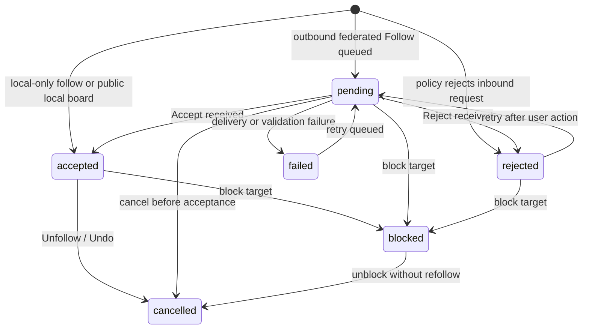

# Follow Users And Boards Design Spec

> Status: Draft for implementation planning
> Date: 2026-05-04
> Scope: Tris-Aura App, `ansible_core/store`, `ansible_core/domain`, `ansible_core/ap`, and sync/feed projections

## Goal

Add first-class follow support for users and boards so a Tris-Aura user can build
a personal "Following" feed from people and communities they care about. Follow
state is social subscription state. It is separate from identity proofing,
Wallet credentials, VC issuance, and Taiwan digital identity data.

## Existing Context

The current codebase has board storage, board ACLs, remote nodes, and
`BoardSyncConfig`, which can enable or disable syncing a board from a remote
node. ActivityPub `Person` objects already expose `followers` and `following`
fields, but there is no local follow graph, no follow state machine, no inbound
or outbound follow activity handling, and no feed projection based on followed
users or followed boards.

The follow feature must therefore introduce a social graph layer without
rewriting the existing board sync layer.

## Design Decision

Use a local-first follow graph with ActivityPub-compatible federation.

- Local state is stored in Drift and exposed through repository interfaces.
- Outbound user follows are represented as ActivityPub-compatible `Follow`
  activities when the target has a remote actor URI.
- Inbound user follows are accepted or rejected through `Accept` / `Reject`
  activities.
- Board follows are represented locally as a follow edge to a board target and,
  when the board is remote, they drive `BoardSyncConfig.syncEnabled = true`.
- Remote board follows use ActivityPub `Follow` to a board actor when a board
  actor URI exists. For MVP, a board actor is represented as an ActivityPub
  `Group`. A future custom extension may add `TrisAuraBoard`, but the MVP must
  remain readable by generic ActivityPub tooling.

This approach keeps the app useful offline and local-first, while leaving a
clean path for federation.

## Non-Goals

- No algorithmic recommendation system.
- No global public follower counts in MVP.
- No private direct messaging.
- No automatic disclosure of Wallet credentials or government identity proofing.
- No requirement that users hold `TrisAuraHumanityCredential` before following.
- No paid, invite-only, or token-gated boards in MVP.
- No destructive deletion of cached historical posts when a follow is removed.

## Domain Terms

- **Local Actor:** The current app user's DID-backed social actor.
- **Target:** A followable entity. Target type is `user` or `board`.
- **User Follow:** A subscription from the local actor to another user actor.
- **Board Follow:** A subscription from the local actor to a board/community.
- **Follow Edge:** The stored relationship between follower and target.
- **Follow Activity:** The protocol event that creates, accepts, rejects, or
  cancels a follow edge.
- **Following Feed:** A projection of content from followed users and followed
  boards.
- **Local-Only Follow:** Follow state used only inside the local app, without a
  federated ActivityPub message.
- **Federated Follow:** Follow state that is mirrored through ActivityPub
  activities to a remote actor or board actor.

## User Follow Behavior

### Follow A User

When the local actor follows a user:

1. The app resolves the target by DID, ActivityPub actor URI, or local user ID.
2. The app creates or updates a `FollowTarget` with `targetType = user`.
3. The app creates a `FollowEdge` with status:
   - `accepted` when the target is local or explicitly local-only;
   - `pending` when a remote ActivityPub follow must be accepted;
   - `failed` when the outbound activity cannot be queued.
4. If the target has a remote inbox, the sync/AP layer sends a signed `Follow`
   activity.
5. The target's public posts become eligible for the Following feed after the
   edge reaches `accepted`.

Following a user must not automatically follow every board the user posts in.
The feed may show the followed user's public posts across visible boards, but
private or ACL-restricted posts remain hidden unless the local actor also has
read access.

### Accept Or Reject An Inbound User Follow

When a remote actor follows the local actor:

1. The inbox validates the activity ID, actor, object, signature, and replay
   protection.
2. The app stores an inbound `FollowEdge` with `direction = inbound`.
3. If local policy allows followers by default, the edge is marked `accepted`
   and an `Accept` activity is queued.
4. If local policy denies the target, the edge is marked `rejected` and a
   `Reject` activity is queued.

MVP policy is auto-accept for public local actors and auto-reject for blocked
actors. A later UI can add manual approval.

### Unfollow A User

When the local actor unfollows a user:

1. The edge status becomes `cancelled`.
2. If a federated follow was previously sent, the app queues an ActivityPub
   `Undo` wrapping the original `Follow`.
3. New content from the target stops appearing in the Following feed.
4. Existing cached posts remain in storage and may still appear in board views.

### Block A User

Blocking is stronger than unfollowing:

1. Any outbound or inbound follow edge involving the blocked actor is marked
   `blocked`.
2. The actor's content is removed from Following feed projections.
3. Inbound follow requests from that actor are rejected.
4. The block state takes precedence over accepted follows.

The MVP spec defines the state transition and repository behavior. A full block
UI can be implemented later.

## Board Follow Behavior

### Follow A Local Board

When the local actor follows a board stored in the local database:

1. The app creates or updates a `FollowTarget` with `targetType = board`.
2. The app creates a `FollowEdge` with status `accepted`.
3. Threads and posts in that board become eligible for the Following feed.
4. No ActivityPub activity is required unless the board has a configured actor
   URI.

### Follow A Remote Board

When the local actor follows a board from a remote node:

1. The app resolves the board by remote node and board ID or board actor URI.
2. The app creates or updates a board `FollowTarget`.
3. The app creates a `FollowEdge` with status `accepted` for public boards or
   `pending` for boards requiring approval.
4. The app creates or updates `BoardSyncConfig` for the remote node and board
   with `syncEnabled = true`.
5. If the board has an ActivityPub actor URI, the app queues a signed `Follow`
   activity to the board actor.
6. Synced threads and posts become eligible for the Following feed after the
   follow is accepted and the local actor has read access.

For MVP, public remote boards can be treated as accepted after local validation.
Private boards require an explicit `Accept` from the board actor or remote node.

### Unfollow A Board

When the local actor unfollows a board:

1. The board follow edge status becomes `cancelled`.
2. If the board is remote, `BoardSyncConfig.syncEnabled` is set to `false` for
   that remote/board pair.
3. If a federated board follow was sent, an ActivityPub `Undo` is queued.
4. The board's content stops appearing in the Following feed.
5. Cached board data remains available in board views unless separately deleted.

### Board ACL Interaction

Board follow is not an authorization grant. Read access is still decided by
board ACL, remote policy, and sync validation.

- A followed public board contributes content to the feed.
- A followed private board contributes content only after the local actor has
  read access.
- If access is revoked, the follow edge may remain `accepted`, but feed
  projection must exclude inaccessible content.

## State Model

### Follow Target

`FollowTarget` represents the thing being followed.

Fields:

- `targetId`: stable local ID for the target.
- `targetType`: `user` or `board`.
- `canonicalUri`: DID, ActivityPub actor URI, board actor URI, or local board
  URI.
- `displayName`: user or board display name.
- `handle`: optional handle such as `@alice@example.social`.
- `did`: optional DID for user targets.
- `actorUri`: optional ActivityPub actor URI.
- `inboxUri`: optional ActivityPub inbox URI.
- `outboxUri`: optional ActivityPub outbox URI.
- `remoteNodeId`: optional remote node ID for remote board targets.
- `boardId`: optional board ID for board targets.
- `boardSlug`: optional board slug for board targets.
- `createdAt`: UTC timestamp.
- `updatedAt`: UTC timestamp.
- `isDeleted`: soft-delete marker.

Uniqueness:

- `canonicalUri` is unique when present.
- For board targets, `(remoteNodeId, boardId)` is unique when both values are
  present.

### Follow Edge

`FollowEdge` represents the relationship.

Fields:

- `followId`: stable local ID.
- `followerDid`: DID of the local or remote follower.
- `targetId`: points to `FollowTarget.targetId`.
- `targetType`: denormalized `user` or `board`.
- `direction`: `outbound` or `inbound`.
- `status`: `pending`, `accepted`, `rejected`, `cancelled`, `blocked`, or
  `failed`.
- `visibility`: `localOnly` or `federated`.
- `remoteActivityId`: original ActivityPub activity ID when applicable.
- `lastError`: optional short diagnostic code.
- `createdAt`: UTC timestamp.
- `updatedAt`: UTC timestamp.
- `acceptedAt`: nullable UTC timestamp.
- `cancelledAt`: nullable UTC timestamp.

Uniqueness:

- `(followerDid, targetId, direction)` is unique for active relationship rows.
- Cancelled rows may be retained for audit, but the repository should expose a
  single effective edge per follower/target/direction.

### Follow Activity Log

Follow transitions should be auditable without overloading `ActivityLog` used by
content sync.

Fields:

- `eventId`: stable local ID.
- `followId`: edge ID.
- `eventType`: `follow_requested`, `follow_accepted`, `follow_rejected`,
  `follow_cancelled`, `follow_blocked`, `follow_failed`, or `follow_synced`.
- `actorDid`: DID that initiated the transition.
- `activityId`: protocol activity ID when applicable.
- `message`: optional short diagnostic.
- `createdAt`: UTC timestamp.

This log is local operational state. It must not include Wallet credential
payloads, national identifiers, or raw identity provider assertions.

### Outbound Follow Activity Queue

Federated follow activities need a durable local queue because remote inbox
delivery can fail while the local app remains usable.

Fields:

- `outboxId`: stable local ID.
- `activityId`: ActivityPub activity ID.
- `activityType`: `Follow`, `Accept`, `Reject`, or `Undo`.
- `targetInboxUri`: destination inbox URI.
- `payloadJson`: serialized ActivityPub activity JSON.
- `status`: `queued`, `delivering`, `delivered`, or `failed`.
- `attemptCount`: integer delivery attempt count.
- `lastError`: optional short diagnostic code.
- `createdAt`: UTC timestamp.
- `updatedAt`: UTC timestamp.
- `deliveredAt`: nullable UTC timestamp.

The queue is transport state. It must not be used as the source of truth for
follow relationships; `FollowEdge` remains authoritative.

## State Transitions



Rules:

- `blocked` overrides every other status.
- `cancelled` stops future feed inclusion but does not delete cached content.
- `failed` can be retried only when the target remains discoverable.
- `acceptedAt` is set only when entering `accepted`.
- `cancelledAt` is set only when entering `cancelled`.

## Repository API

Introduce a `FollowRepository` in `ansible_core/store`.

Required methods:

- `Future<FollowTarget?> getTarget(String targetId)`
- `Future<FollowTarget?> getTargetByCanonicalUri(String canonicalUri)`
- `Future<FollowTarget?> getBoardTarget(String remoteNodeId, String boardId)`
- `Future<void> upsertTarget(FollowTarget target)`
- `Future<FollowEdge?> getEdge(String followerDid, String targetId, FollowDirection direction)`
- `Future<List<FollowEdge>> listFollowing(String followerDid, {FollowTargetType? targetType})`
- `Future<List<FollowEdge>> listFollowers(String targetId)`
- `Future<void> upsertEdge(FollowEdge edge)`
- `Future<void> updateEdgeStatus(String followId, FollowStatus status, DateTime now, {String? lastError})`
- `Future<void> recordEvent(FollowActivityEvent event)`
- `Future<List<FollowActivityEvent>> listEvents(String followId)`

The repository must have Drift and in-memory implementations. In-memory support
is required because existing store tests use in-memory repositories for domain
behavior.

Introduce a `FollowActivityOutboxRepository` for delivery queue operations:

- `Future<void> enqueue(OutboundFollowActivity activity)`
- `Future<List<OutboundFollowActivity>> listQueued({int limit = 50})`
- `Future<void> markDelivering(String outboxId, DateTime now)`
- `Future<void> markDelivered(String outboxId, DateTime now)`
- `Future<void> markFailed(String outboxId, String lastError, DateTime now)`

## Domain Services

### FollowService

`FollowService` owns transitions and cross-repository side effects.

Responsibilities:

- Resolve or create `FollowTarget`.
- Create outbound user and board follows.
- Accept, reject, cancel, and block follows.
- Queue ActivityPub activities through a protocol adapter.
- Toggle `BoardSyncConfig` when remote board follows change.
- Emit follow activity log events.

The service should not build UI state and should not verify Wallet credentials.

### FollowFeedProjector

`FollowFeedProjector` builds read models for the Following feed.

Inputs:

- Accepted outbound user follows.
- Accepted outbound board follows.
- Board ACL/read visibility.
- Posts, threads, boards, and users already present in local store.
- Blocked actors.

Output:

- Chronological feed entries ordered by `lastEditAt`, then `createdAt`.
- Deduplicated by post ID.
- Board-follow matches include all visible posts in followed boards.
- User-follow matches include visible posts authored by followed users.
- If a post matches both a followed user and a followed board, the feed entry
  records both reasons but appears once.

MVP ranking is reverse chronological only.

## Protocol Specification

### Activity IDs

Follow activity IDs must be globally unique and stable:

```text
https://{local-node-host}/activities/follow/{uuid}
```

Local-only follows may use:

```text
local://follow/{uuid}
```

### Follow User Activity

```json
{
  "@context": "https://www.w3.org/ns/activitystreams",
  "id": "https://node.example/activities/follow/6a4b",
  "type": "Follow",
  "actor": "did:key:z6MkwLocalActor",
  "object": "https://remote.example/users/alice",
  "to": ["https://remote.example/users/alice"],
  "published": "2026-05-04T00:00:00Z"
}
```

### Follow Board Activity

For MVP, boards that federate are represented as ActivityPub `Group` actors.

```json
{
  "@context": [
    "https://www.w3.org/ns/activitystreams",
    "https://trisaura.io/ns/follow"
  ],
  "id": "https://node.example/activities/follow/board-9d10",
  "type": "Follow",
  "actor": "did:key:z6MkwLocalActor",
  "object": "https://remote.example/boards/civic-tech",
  "to": ["https://remote.example/boards/civic-tech"],
  "published": "2026-05-04T00:00:00Z",
  "trisAura:targetType": "board",
  "trisAura:boardId": "board-civic-tech"
}
```

Generic ActivityPub servers can read this as a normal `Follow`. Tris-Aura nodes
can additionally use `trisAura:targetType` and `trisAura:boardId`.

### Accept Follow

```json
{
  "@context": "https://www.w3.org/ns/activitystreams",
  "id": "https://remote.example/activities/accept/42",
  "type": "Accept",
  "actor": "https://remote.example/users/alice",
  "object": {
    "id": "https://node.example/activities/follow/6a4b",
    "type": "Follow",
    "actor": "did:key:z6MkwLocalActor",
    "object": "https://remote.example/users/alice"
  },
  "to": ["did:key:z6MkwLocalActor"],
  "published": "2026-05-04T00:00:10Z"
}
```

### Reject Follow

`Reject` has the same shape as `Accept`, with `"type": "Reject"`.

### Undo Follow

```json
{
  "@context": "https://www.w3.org/ns/activitystreams",
  "id": "https://node.example/activities/undo/follow-6a4b",
  "type": "Undo",
  "actor": "did:key:z6MkwLocalActor",
  "object": {
    "id": "https://node.example/activities/follow/6a4b",
    "type": "Follow",
    "actor": "did:key:z6MkwLocalActor",
    "object": "https://remote.example/users/alice"
  },
  "to": ["https://remote.example/users/alice"],
  "published": "2026-05-04T00:05:00Z"
}
```

## Sync Interaction

Follow state and content sync are related but distinct.

- User follows decide which authored content appears in the Following feed.
- Board follows decide which board content appears in the Following feed.
- Remote board follows also enable `BoardSyncConfig` so board content can be
  pulled into local storage.
- Unfollowing a remote board disables the matching `BoardSyncConfig`.
- Follow state must not be embedded into normal post/thread sync records.
- Follow ActivityPub envelopes can pass through `/inbox`.
- `/sync/delta` should continue returning content mutations. It may later accept
  optional filters for followed boards or followed actors, but the MVP can
  project feed results locally after content arrives.

The existing `ansible_sync_spec_v0.1.md` remains the content sync spec. This
document defines the social subscription layer above it.

## UI Specification

### User Follow Controls

User profile surfaces must show one primary follow control:

- `Follow`: no active edge.
- `Requested`: outbound federated edge is pending.
- `Following`: edge is accepted.
- `Follow failed`: edge is failed and can be retried.
- `Blocked`: target is blocked.

Actions:

- `Follow` creates an outbound edge.
- `Unfollow` cancels an accepted or pending edge.
- `Retry` moves a failed edge back to pending and queues delivery.
- `Block` marks the target blocked.

### Board Follow Controls

Board list and board detail surfaces must show:

- `Follow board`
- `Following`
- `Requested`
- `Sync failed`
- `Unfollow`

For remote boards, the UI should show sync health separately from follow status:

- Follow status: social relationship state.
- Sync status: whether board content is successfully being pulled.

### Following Feed

Add a top-level feed filter:

- `All`: current broad feed behavior.
- `Following`: posts from followed users and followed boards.
- `Boards`: existing board navigation.

Following feed entries should display a compact reason label:

- `Followed user`
- `Followed board`
- `Followed user + board`

No explanation text about Wallet credentials should appear in follow UI.

## Privacy And Identity Boundaries

- Follow operations use the app's social actor identity, not government identity.
- A remote federated follow reveals the local actor to the remote target.
- A local-only follow remains private to the local database.
- Follow envelopes must not include:
  - `TrisAuraHumanityCredential`
  - Verifiable Presentation payloads
  - national ID
  - legal name
  - birth date
  - address
  - certificate serial
  - TW FidO / MOICA raw assertions
- A user's verified-human status may be shown as a label if already available,
  but it must not be required for follow MVP.

## Security Requirements

- Validate inbound ActivityPub activity ID uniqueness to prevent replay.
- Validate actor/object consistency before accepting `Accept`, `Reject`, or
  `Undo`.
- Require signatures for federated follow activities when the remote actor has a
  verifiable public key or DID document.
- Do not allow remote activities to create local follows on behalf of the local
  actor.
- Apply block state before feed projection.
- Treat malformed follow activities as rejected input and record a diagnostic
  event with `follow_failed`.
- Do not crash feed projection when a target has been deleted or a remote node
  is unavailable.

## Error Handling

| Case | Behavior |
| --- | --- |
| Target cannot be resolved | Do not create an edge; show `target_not_found`. |
| Remote inbox unavailable | Store edge as `failed`; allow retry. |
| Remote rejects follow | Mark edge `rejected`; remove from Following feed. |
| Remote accept references unknown follow | Ignore and record diagnostic event. |
| Board sync fails after follow | Keep follow edge; mark sync health failed. |
| Board ACL revokes access | Keep follow edge; exclude inaccessible content. |
| Duplicate follow request | Return existing effective edge. |
| Unfollow already-cancelled edge | Treat as idempotent success. |

## Testing Requirements

### Store Tests

- Create, retrieve, update, and list follow targets.
- Enforce unique canonical URI.
- Enforce unique effective edge for follower/target/direction.
- List following users and boards separately.
- Record follow activity events.
- Preserve cancellation history in `FollowActivityEvent` while exposing one
  effective edge per follower/target/direction.
- Enqueue and update outbound follow delivery records.

### Domain Tests

- Follow local user creates accepted outbound edge.
- Follow remote user creates pending federated edge and queues `Follow`.
- Accept remote follow changes pending edge to accepted.
- Reject remote follow changes pending edge to rejected.
- Unfollow accepted remote user queues `Undo`.
- Follow remote board enables `BoardSyncConfig`.
- Unfollow remote board disables `BoardSyncConfig`.
- Blocked user is excluded from Following feed.

### Protocol Tests

- Serialize user `Follow`, board `Follow`, `Accept`, `Reject`, and `Undo`.
- Parse inbound follow activities with ActivityPub-compatible shape.
- Reject malformed activities missing actor or object.
- Reject `Accept` for unknown original follow.
- Reject replayed activity IDs.

### App Tests

- User follow button transitions through Follow -> Requested -> Following.
- Board follow button enables follow state and sync state display.
- Following feed includes followed board posts.
- Following feed includes followed user posts.
- Following feed deduplicates posts matching both reasons.
- Unfollow removes future feed projection without deleting cached posts.

## Implementation Phases

### Phase 1: Store Layer

Create follow target, follow edge, and follow activity event entities, Drift
tables, generated database code, repository interfaces, Drift implementations,
and in-memory implementations.

Schema version should increment from the current store schema version. The
migration must create the new tables without changing existing board, post,
wallet, or sync tables.

### Phase 2: Domain State Machine

Create `FollowService` with explicit methods for:

- `followUser`
- `followBoard`
- `acceptFollow`
- `rejectFollow`
- `unfollow`
- `blockTarget`
- `retryFollow`

The service should return typed results rather than throwing for expected
business states such as duplicate follows or unresolved targets.

### Phase 3: Protocol Adapter

Extend `ansible_core/ap` with follow activity models and parsing helpers. The
adapter should produce plain Dart objects that the sync handler can validate and
dispatch to `FollowService`.

### Phase 4: Sync Integration

Route inbound `/inbox` follow activities to the protocol adapter. Add
`FollowActivityOutboxRepository` for durable outbound delivery and connect the
delivery worker to remote inbox POST requests. Connect remote board
follow/unfollow to `BoardSyncConfigRepository`.

### Phase 5: Feed Projection

Add Following feed query/projector support. The first implementation can compute
the projection from existing local tables at read time. A materialized feed
table is not required for MVP.

### Phase 6: App UI

Add follow controls to user/board surfaces and add a Following feed filter in
the main app shell. UI should use existing app visual conventions and avoid
introducing Wallet or VC wording into follow screens.

## Acceptance Criteria

The feature is ready for initial production hardening when:

- A local user can follow and unfollow another local user.
- A local user can follow and unfollow a local board.
- A remote board follow toggles `BoardSyncConfig` correctly.
- A remote user follow produces a pending edge and serialized `Follow` activity.
- An inbound `Accept` changes the edge to accepted.
- The Following feed includes accepted followed users and boards only.
- Blocked targets do not appear in the Following feed.
- Follow protocol tests cover malformed and replayed activities.
- Store, domain, protocol, and app tests pass.
- No follow envelope contains Wallet credential payloads or Taiwan digital
  identity assertions.

## Review Notes

The MVP deliberately treats boards as ActivityPub `Group` actors for federation.
This is a conservative interoperability choice. If later Tris-Aura needs richer
board semantics, add a `TrisAuraBoard` extension while continuing to emit a
generic `Group` shape for compatibility.

The MVP also keeps follow counts local or omitted. Public follower/following
collections can be added after moderation, privacy, and abuse controls are in
place.
